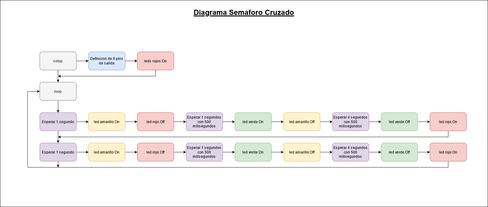
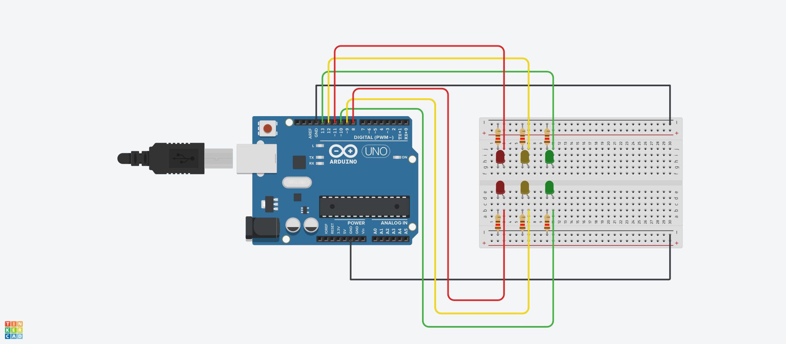

# ucc-electiva-iv
## Semaforo Cruzado
Consta de un circuito  que representa la funcionalidad de un semáforo Cruzado.
### Componentes requeridos para la contrucción 
1. Placa de arduino uno
2. Breadboard small
3. leds (6)
4. Resistencias 120Ω (6)
5. Pins (6)
6. jumper
### Diagrama

### Circuito

### Link Tinkercad
https://www.tinkercad.com/things/g5w4iE9toxr 