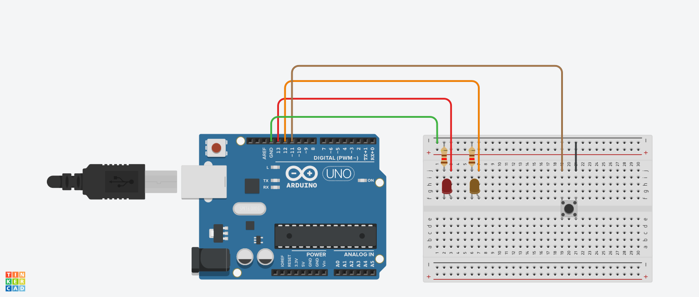

# ucc-electiva-iv
## Semaforo Simple
Basicamente consta de un circuito  que representa la funcionalidad de un semáforo.
### Componentes requeridos para la contrucción 
1. Placa arduino (1)
2. Protoboard (1)
3. Leds (2)
4. Pulsador (1)
5. resistencias de 120 Ω (2)
6. Jumpers (Cables)
### Diagrama

### Circuito

