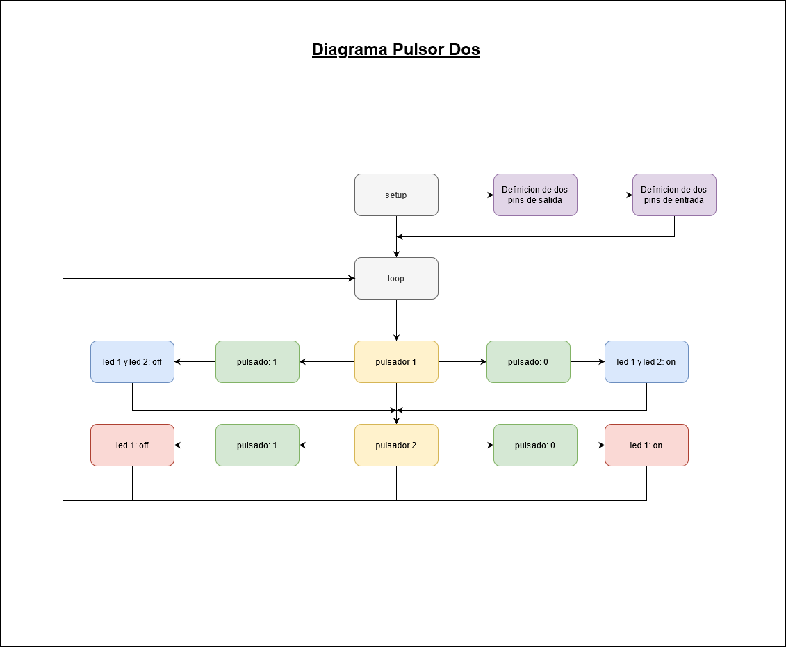
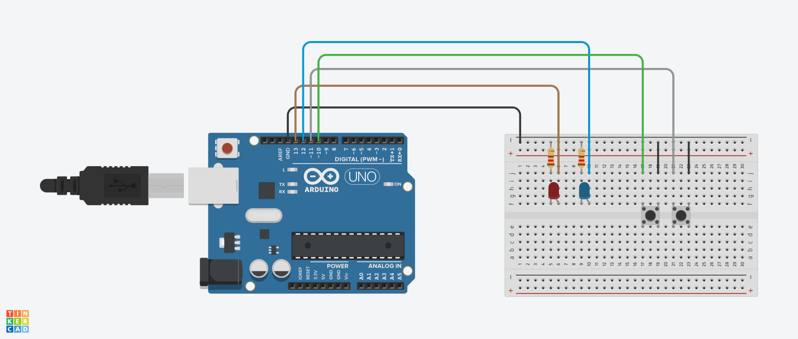

# ucc-electiva-iv
## Pulsador Dos
Implementar 2 pulsadores que condicionen el encendido de 2 Leds, de la siguiente forma: Pulsador 1 = Enciende los dos led, Pulsador 2 = Enciende 1 solo Led.
### Componentes requeridos para la contrucción 
1. Placa arduino (1)
2. Protoboard (1)
3. led (2)
4. Pulsores (2)
5. Resistencias de 120 Ω (2)
6. Jumpers

### Diagrama

### Circuito

