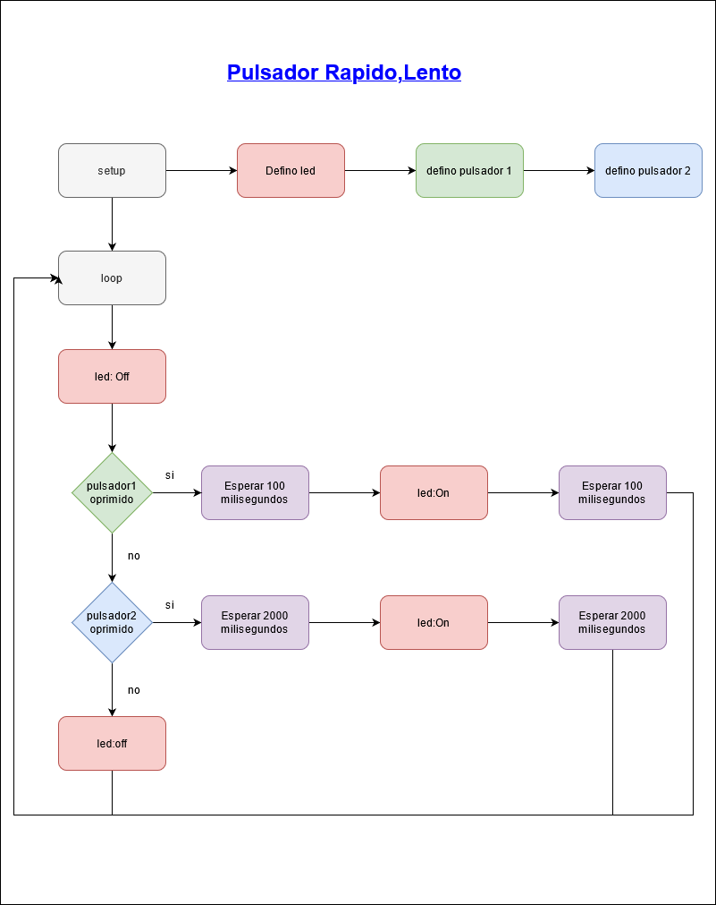
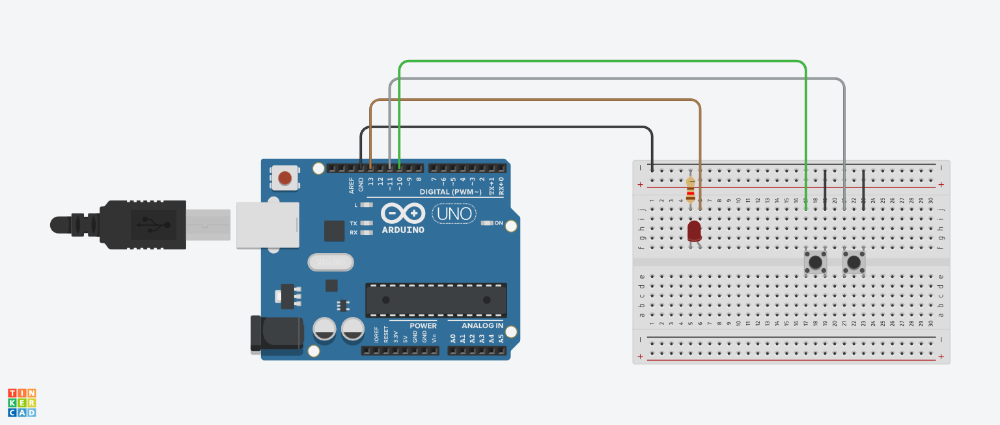

# ucc-electiva-iv
## pulsador rapido lento
Led controlado por pulso rapido y pulso lento
### Componentes requeridos para la contrucción 
1. Placa de arduino (1)
2. Breadboard small (1)
3. led (1)
4. Resistencia 120Ω (1)
5. pulsores (2)
6. jumper 
### Diagrama

### Circuito

### Link Tinkercad
https://www.tinkercad.com/things/luQgv129n2z 

