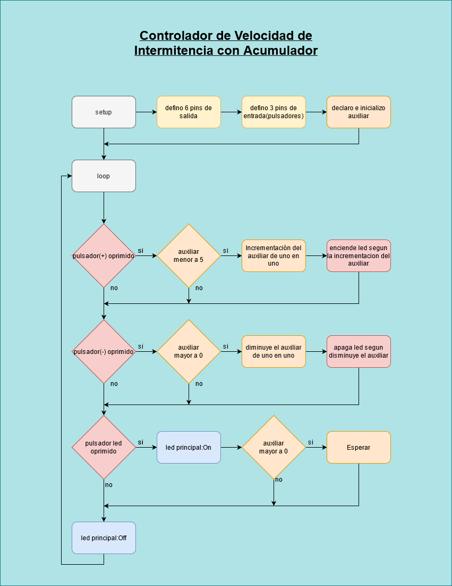
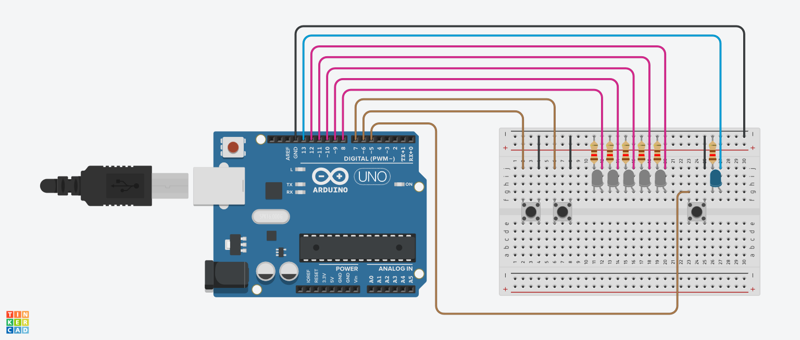

# ucc-electiva-iv
## Controlador de Velocidad de Intermitencia con Acumulador
El circuito debe contener 5 led que representen la velocidad de intermitencia, estos se deben mantener encendidos para representar la velocidad que es controlada por dos pulsadores (el resta y el de suma) cada led de este indicador equivale a 200ms de espera en la intermitencia del led piloto, este led debe ser encendido cuando se mantenga oprimido un pulsador de inicio.
### Componentes requeridos para la contrucción 
1. Placa de arduino (1)
2. Breadboard small (1)
3. led (6)
4. Resistencia 120Ω (6)
5. pulsores (3)
6. jumper 
### Diagrama

### Circuito

### Link Tinkercad
https://www.tinkercad.com/things/dFB5j9H6nd2 

