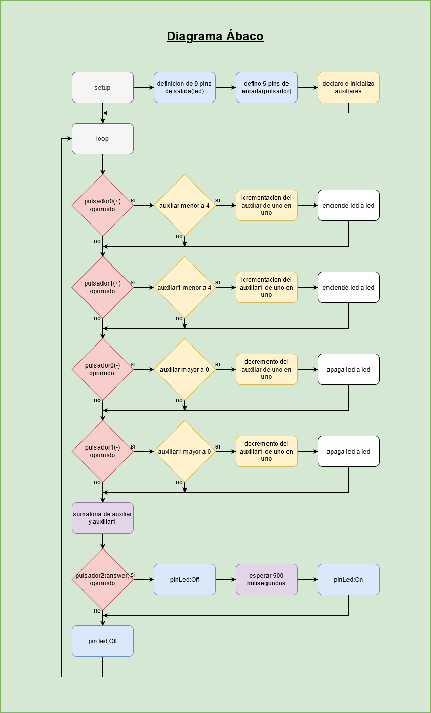
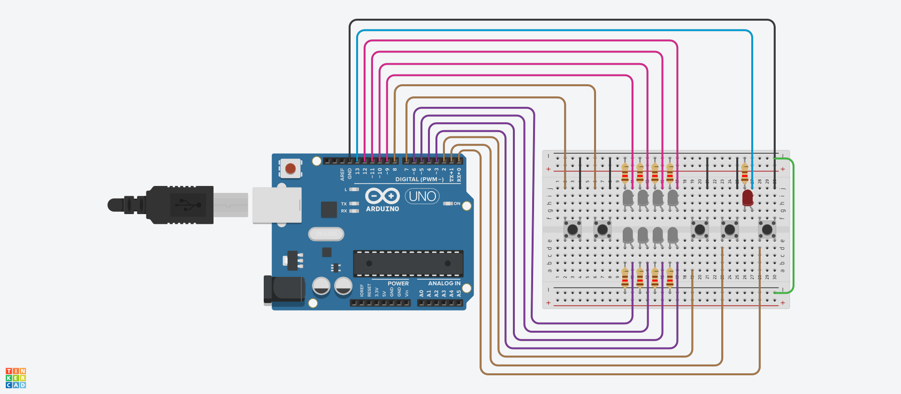

# ucc-electiva-iv

## Ábaco

El circuito debe contener 9 led que representan 2 lineas de abaco de 4 leds cada una y 1 led de resultado el cual debe informar del resultado de la suma mediante la intermitencia, es decir cada que se oprima el pulsador de resultado el led debe emitir una cantidad de parpadeos equivalentes al resultado.

Para mover las dos lineas de los abacos, debe haber 2 pulsadores por linea para sumar y restar, es decir ir encendiendo leds para la suma y apagando leds para el pulso de resta.

### Componentes requeridos para la contrucción

1. Placa de arduino (1)
2. Breadboard small (1)
3. led (9)
4. Resistencia 120Ω (9)
5. pulsores (5)
6. jumper

### Diagrama

### Circuito

### Link Tinkercad

https://www.tinkercad.com/things/eeGDswOWkm0 
