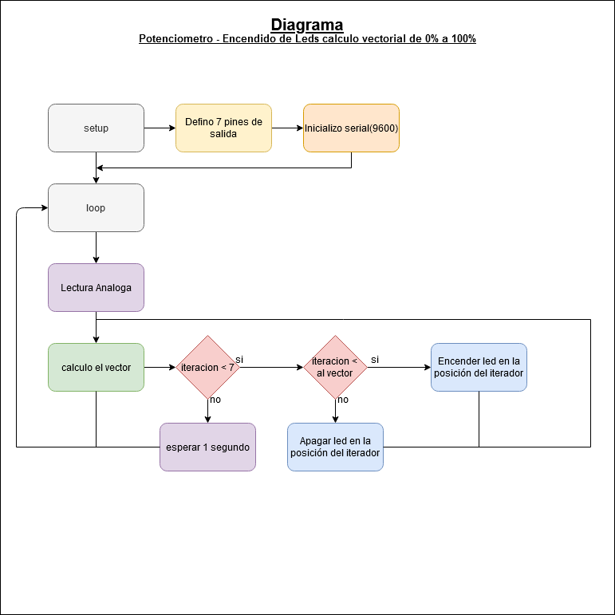
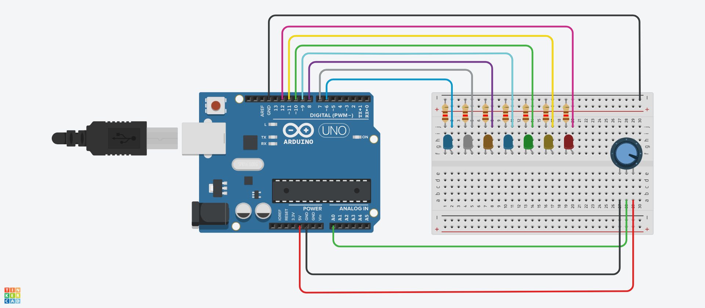

# ucc-electiva-iv
Potenciometro - Encendido de Leds calculo vectorial de 0% a 100%
## Potencimetro

Implementar un potenciometro que determine el encendido de 7 Led, mediante calculo vectorial de la funcion map.

### Componentes requeridos para la contrucción

1.  1 Placa arduino UNO
2.  1 Protoboard
3.  7 Leds
4.  7 resistencias de 120 Ω
5.  1 Potenciómetro de 250 kΩ
6.  Jumpers (Cables)

### Diagrama

### Circuito

### Link Tinkercad

https://www.tinkercad.com/things/fKvgBU1twhL 
