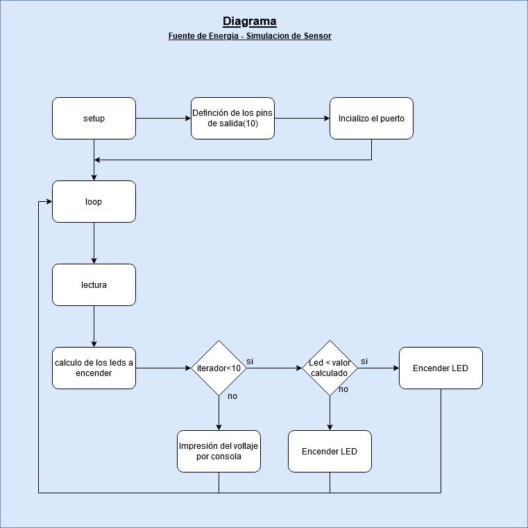
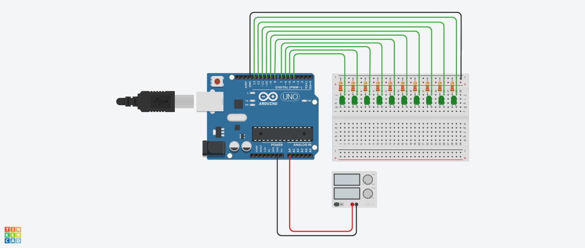

# ucc-electiva-iv
Fuente de Energia - Simulacion de Sensor
## Potencimetro
### Componentes requeridos para la contrucción

1. 1 Placa arduino UNO
2. 1 Protoboard
3. 7 Leds
4. 7 resistencias de 120 Ω
5. 1 Potenciómetro de 250 kΩ
6. Jumpers (Cables)

### Diagrama

### Circuito

### Link Tinkercad

https://www.tinkercad.com/things/iAvFJHJC0Nz 
