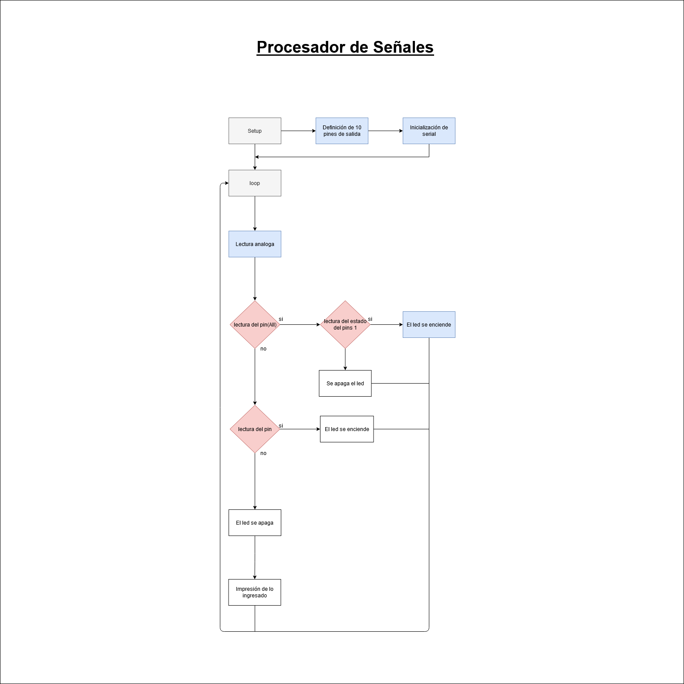
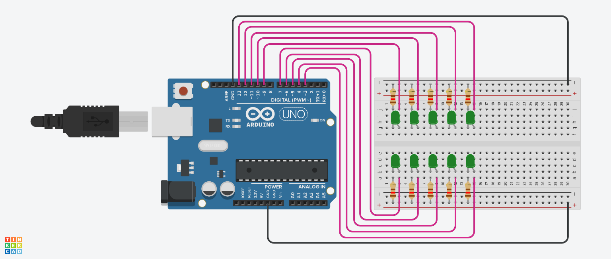

# ucc-electiva-iv

## Procesador de Señales 
- Encender Led Indicados por Señal
### Componentes requeridos para la contrucción

1. 1 Placa arduino UNO
2. 1 Protoboard
3. 10 Leds
4. 10 resistencias de 120 Ω
5. Jumpers (Cables)

### Diagrama

### Circuito

### Link Tinkercad

https://www.tinkercad.com/things/jg4Zr5hjJvj 
