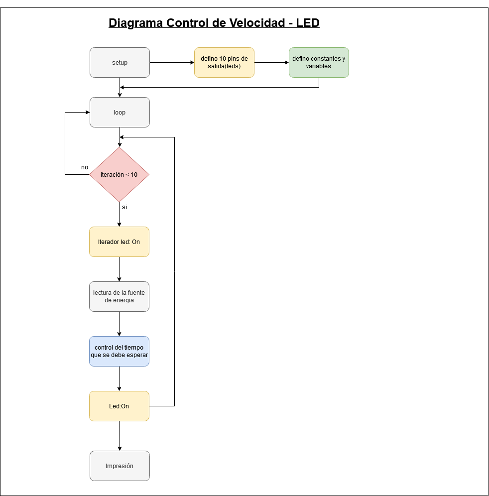
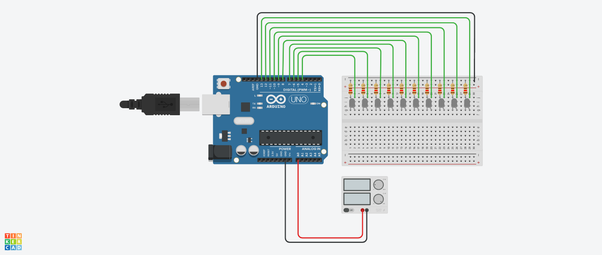

# ucc-electiva-iv

## Control de Velocidad - LED

Haciendo uso del circuito actual (Fuente de poder ) hacer que un solo led  se encienda se mueva encendido por cada uno de los led que se encuentran apagados (el efecto es que la luz va pasando de un led a otro, por donde ya pasó se apague, ejemplo de derecha izquierda y cuando llegue a la izquierda vuelva a iniciar en el sentido de derecha a izquierda),  de acuerdo a la velocidad que se le configure en la fuente la cual consiste en: menor voltaje menor velocidad y a mayor voltaje mayor velocidad.

### Componentes requeridos para la contrucción

1. 1 Placa arduino UNO
2. 1 Protoboard
3. 10 Leds
4. 1 fuente de energía
5. 10 resistencias de 120 Ω
6. Jumpers (Cables)

### Diagrama

### Circuito

### Link Tinkercad

https://www.tinkercad.com/things/cPx4Z3xcPWJ 
