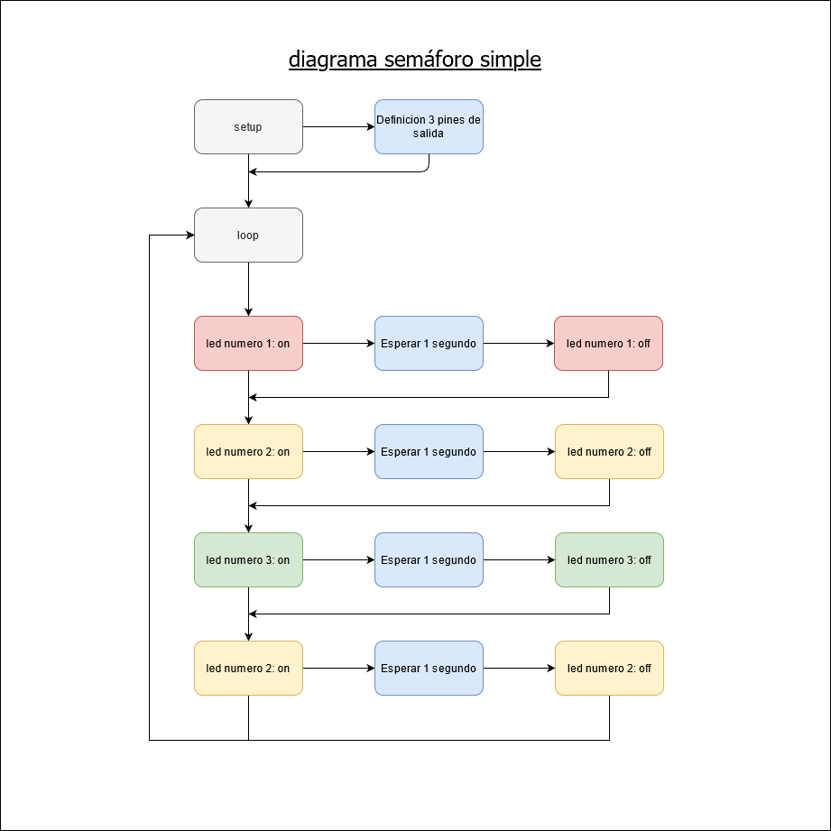
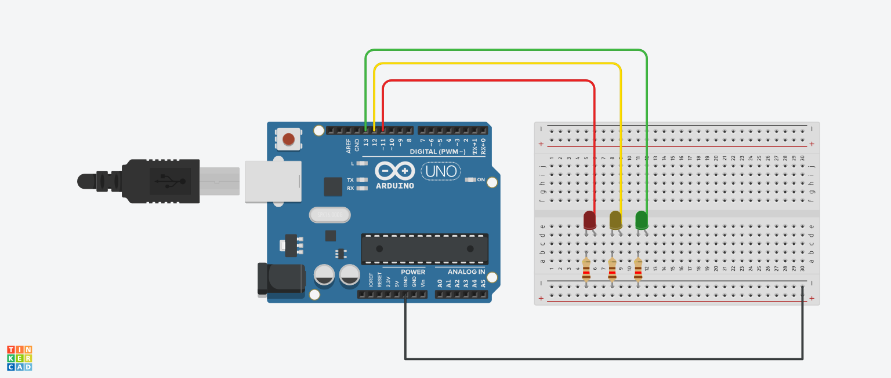

# ucc-electiva-iv
## Semaforo Simple
Basicamente consta de un circuito  que representa la funcionalidad de un semáforo.
### Componentes requeridos para la contrucción 
1. Placa de arduino uno
2. Breadboard small
3. Bombillos led (tres)
4. Resistencias (tres de 120 hm)
5. Pins (tres)
6. jumper (uno)
### Diagrama

### Circuito

